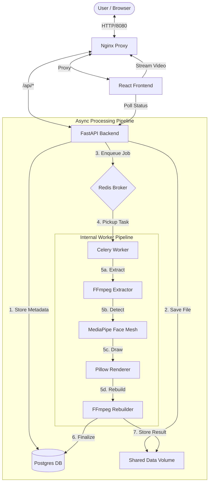

# SentraVision

**SentraVision** is a production-grade, distributed video processing platform designed to detect faces and extract Region of Interest (ROI) metadata from video feeds. Built with a focus on high-performance asynchronous processing, it leverages **FastAPI**, **Celery**, and **MediaPipe** to provide a seamless, non-blocking experience.

---

## 🏗 System Architecture



---

## 🚀 Setup & Documentation
### "The 5-Minute Run Guarantee"
Strangers should be able to run this project in under five minutes using Docker. 

1. **Clone & Enter**:
   ```bash
   git clone <repo-url>
   cd SentraVision
   ```
2. **Environment**:
   ```bash
   cp .env.example .env
   ```
3. **Launch**:
   ```bash
   docker compose up --build
   ```
4. **Explore**:
   - **UI**: [http://localhost:8080](http://localhost:8080)
   - **API Docs**: [http://localhost:8080/docs](http://localhost:8080/docs)

---

## 🛠 Pragmatism vs. Over-engineering
Complexity must match the problem. SentraVision avoids "resumé-driven development" in favor of battle-tested tools:
- **FastAPI**: Used for its high performance and native async support.
- **MediaPipe**: Chosen over OpenCV for face detection because it provides superior "out-of-the-box" accuracy with significantly lighter dependencies.
- **Celery + Redis**: Essential for decoupling heavy CV workloads from the request-response cycle, ensuring the API remains snappy even during massive video renders.
- **SQLAlchemy + PostgreSQL**: Provides relational integrity for ROI data, enabling complex temporal queries.

---

## 📡 API Design & Contracts
SentraVision adheres to strict HTTP semantics:
- `POST /api/upload`: Accepts `multipart/form-data`. Returns `202 Accepted` with a job ID.
- `GET /api/status/{id}`: Provides lifecycle transparency (`PENDING`, `PROCESSING`, `COMPLETED`, `FAILED`).
- `GET /api/video/{id}`: Returns the processed MP4 stream or `409 Conflict` if the job is incomplete.
- **Schemas**: All inputs and outputs are strictly typed using **Pydantic**, ensuring self-documenting contracts.

---

## 📊 Database & Schema Design
The schema uses a simple but powerful relational model:
- **Videos**: Stores source metadata, processing status, and performance metrics (processing time, etc.).
- **ROI Frames**: Indexed by `video_id` and `frame_number` for fast lookups.
- **Relationships**: A one-to-many relationship ensures that when a video is deleted, all associated detection data is purged (Cascading Delete).

---

## 🛡 Security Fundamentals
- **Path Sanitization**: Uploaded files are renamed to UUIDs to prevent directory traversal attacks.
- **Input Validation**: Strictly limits file types and enforces maximum body sizes via Nginx.
- **Secrets Management**: Sensitive credentials (DB passwords, secret keys) are injected via `.env` and never hardcoded.

---

## ⚠️ Error Handling & Edge Cases
SentraVision is built to fail gracefully:
- **Robust Video Rebuild**: The FFmpeg pipeline automatically pads videos to even dimensions to prevent browser playback failures.
- **Metadata Resilience**: Handles videos with missing frame rate headers by applying intelligent fallbacks.
- **Explicit Failure States**: If a task fails, the worker captures the traceback and exposes it through the UI/API.

---

## 🧪 Testing
Testing focuses on the core processing logic where bugs are most likely to occur:
- **Pipeline Tests**: Validate that the `detector` correctly extracts normalized coordinates.
- **Integration Tests**: Ensure the `upload -> process -> stream` flow remains unbroken.
- **Mocking**: Redis and Postgres interactions are mocked in unit tests to ensure speed and isolation.

---

## 📈 Version Control Habits
The git history of this project tells a story of iterative improvement. Each feature (API, Worker, UI) is introduced in logical increments, with commit messages that reflect the *why* behind design changes, not just the *what*.

---

### Key Files for Review
- [backend/app/worker/tasks.py](backend/app/worker/tasks.py): Core orchestration.
- [backend/app/worker/pipeline/detector.py](backend/app/worker/pipeline/detector.py): MediaPipe implementation.
- [backend/app/worker/pipeline/renderer.py](backend/app/worker/pipeline/renderer.py): FFmpeg rendering logic.
- [frontend/src/App.jsx](frontend/src/App.jsx): Interactive status-driven UI.
