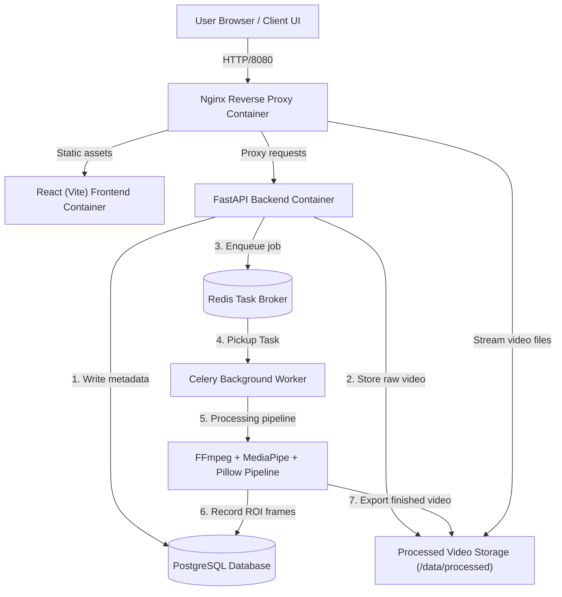
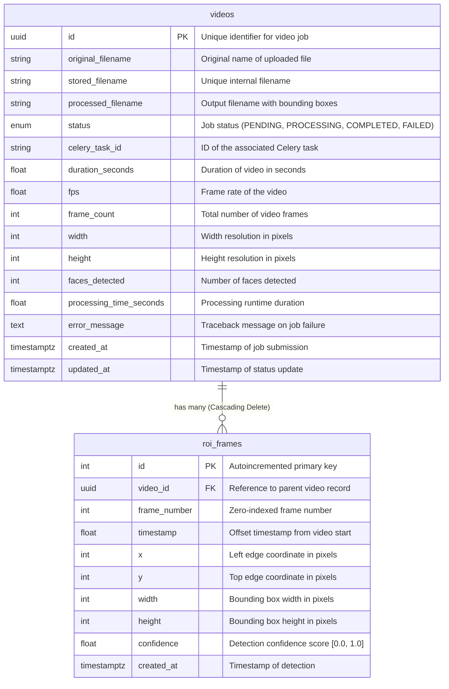

# SentraVision Architecture Documentation

This document describes the high-level system architecture and relational database schema details for the SentraVision project.

## System Flowchart

## Relational Database Schema Model

The PostgreSQL schema models videos and their associated Region of Interest (ROI) face detection details:

