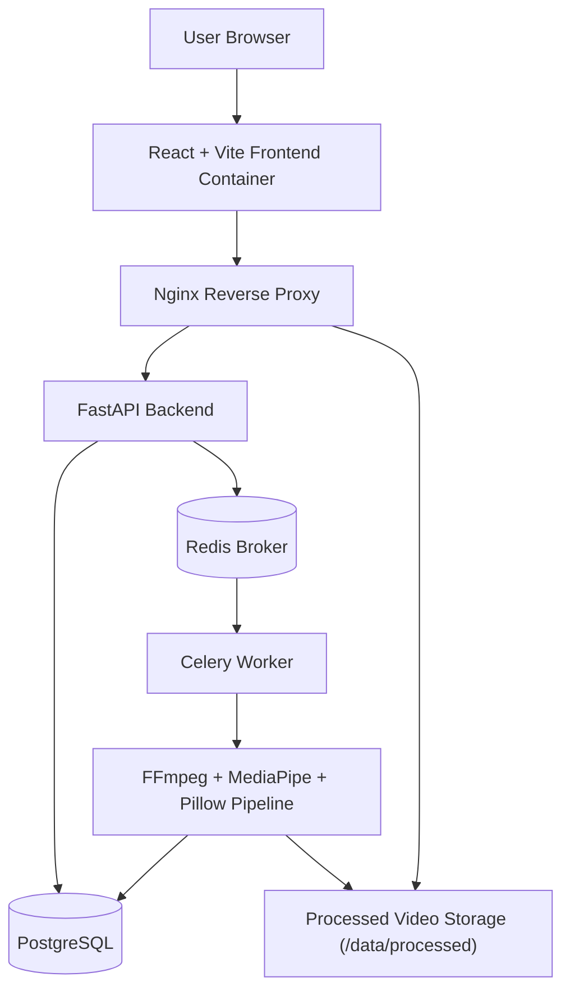
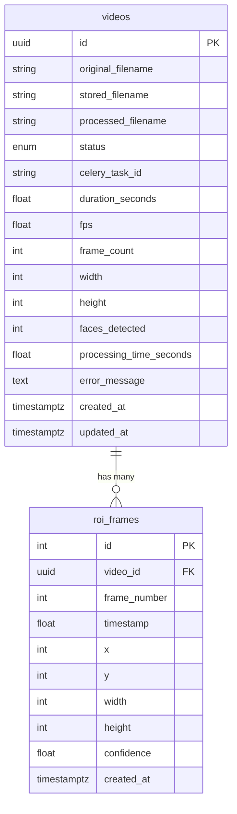

# SentraVision Architecture

```mermaid
flowchart TD
    U["User Browser"] --> FE["React + Vite Frontend Container"]
    FE --> NX["Nginx Reverse Proxy"]
    NX --> API["FastAPI Backend"]
    API --> DB[("PostgreSQL")]
    API --> RQ[("Redis Broker")]
    RQ --> CW["Celery Worker"]
    CW --> VP["FFmpeg + MediaPipe + Pillow Pipeline"]
    VP --> DB
    VP --> FS["Processed Video Storage (/data/processed)"]
    NX --> FS
```

```mermaid
erDiagram
    videos ||--o{ roi_frames : "has many"
    videos {
      uuid id PK
      string original_filename
      string stored_filename
      string processed_filename
      enum status
      string celery_task_id
      float duration_seconds
      float fps
      int frame_count
      int width
      int height
      int faces_detected
      float processing_time_seconds
      text error_message
      timestamptz created_at
      timestamptz updated_at
    }
    roi_frames {
      int id PK
      uuid video_id FK
      int frame_number
      float timestamp
      int x
      int y
      int width
      int height
      float confidence
      timestamptz created_at
    }
```
